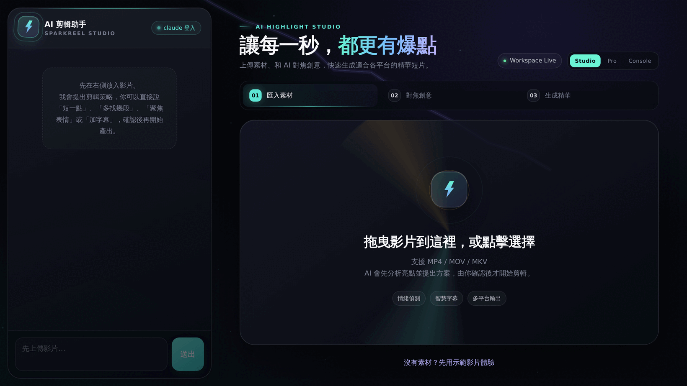
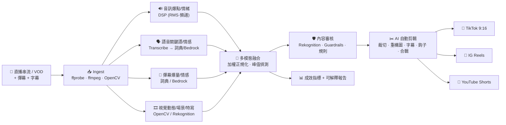
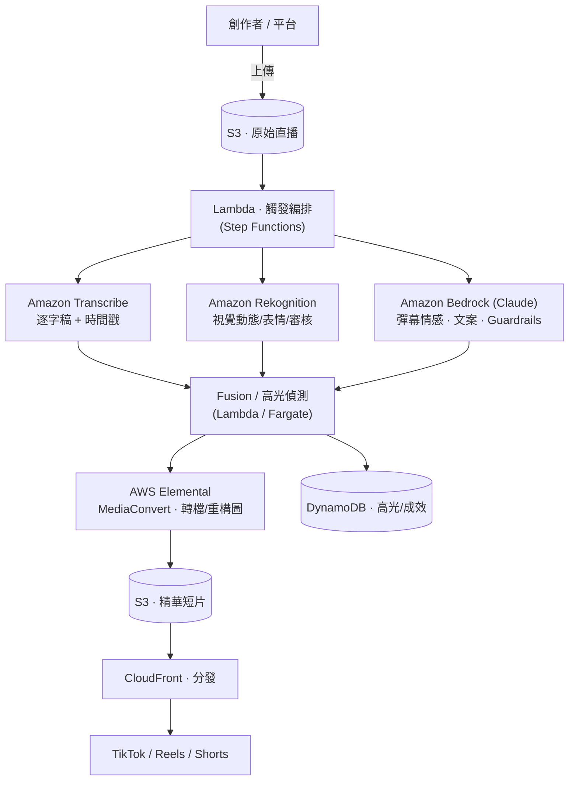

<div align="center">

# ⚡ SparkReel 亮點秒剪

**從直播串流即時辨識高光時刻，AI 自動剪出多平台精華短片**

語音情緒 × 彈幕情感 × 視覺動態 × 逐字稿關鍵語　→　多模態融合高光偵測　→　自動裁切拼接 × 敘事結構 × 多風格產出

`本地即跑（零 AWS 憑證）` · `一鍵切換 AWS 雲端` · `CLI + Web 雙介面` · `TikTok / IG Reels / YouTube Shorts`

</div>

---

## 📌 一句話

主播結束一場 2 小時直播後，SparkReel 在幾分鐘內自動找出全場最精彩的數個瞬間，
剪成帶字幕、帶開場鉤子、符合各社群平台規格的直式短片——**把 1 小時的人工剪輯壓縮到數十秒的自動化。**

<div align="center">

<br><em>打開後的首頁 · AI Highlight Studio：上傳素材、和 AI 對焦創意，一鍵生成多平台精華短片</em>
</div>

---

## ✨ 核心亮點

| | 功能 | 說明 |
|---|---|---|
| 🎯 | **多模態高光偵測** | 融合 9 種訊號（音量爆點、語音情緒、彈幕爆量、彈幕情感、關鍵語、畫面動態、場景切換、特寫反應…），非單一維度 |
| 🧠 | **可解釋的高光** | 每個高光都標註「為什麼」——哪些訊號在燃、逐字稿與熱門彈幕證據，不是黑箱 |
| ✂️ | **AI 自動剪輯引擎** | 幀級精準裁切、9:16 重構圖、燒錄字幕、開場鉤子、精華合輯敘事拼接 |
| 📱 | **多風格多平台** | 一個高光 → TikTok / IG Reels / YouTube Shorts 三種版型（字幕位置、時長、鉤子語氣各自適配） |
| 🛡️ | **內容審核與合規** | 視覺 + 語音 + 文字三模態審核，違規阻擋 / 消音 / 送人工複審 |
| ☁️ | **本地 + AWS 雙模式** | 每個能力可獨立切換 `local`↔`aws`；憑證缺失自動降級，Demo 永不中斷 |
| 📊 | **量化成效** | 節省剪輯時間比例、偵測信心、品質評分、自動化程度、內容再利用壓縮比 |

---

## 🚀 快速開始

### 環境需求
- Python ≥ 3.10、**ffmpeg / ffprobe**（唯一系統相依）
- （選用）AWS 憑證——啟用 Bedrock / Rekognition / Transcribe / MediaConvert

### 安裝
```bash
git clone https://github.com/mimimaomao1117/sparkreel.git && cd sparkreel
python3 -m venv .venv && source .venv/bin/activate     # 建議用虛擬環境（Debian/PEP 668）
pip install -e .                                       # 需 AWS 雲端能力： pip install -e ".[aws]"
```
> 系統需求：Python ≥ 3.10 與 **ffmpeg / ffprobe**（唯一的系統相依）。

### 🚀 最快上手：一鍵示範（無需任何素材或雲端憑證）
```bash
cd sparkreel
bash scripts/demo.sh
```
會**自動生成一段示範直播**（影片＋彈幕＋字幕，以 ffmpeg 合成）→ 分析 → 在
`assets/output/<job>/` 產出短片、縮圖、精華合輯與 `result.json` 報告。

### 🖥️ 網頁 Live Demo（推薦展示用）
```bash
sparkreel serve                     # 啟動後打開瀏覽器 → http://127.0.0.1:9999
```
網頁操作：**① 選素材或上傳影片 → ② 勾選平台（TikTok/Reels/Shorts）→ ③ 點「開始分析」**
→ 即時進度、多模態分數曲線、可線上播放與下載的短片、內容審核報告。
（換埠：`sparkreel serve --port 9999`；預設就是 9999。）

### 👥 團隊協作主控台（一起開發此 Agent）
```bash
sparkreel console                   # 啟動後打開瀏覽器 → http://127.0.0.1:9998
```
一個**密碼登入**的團隊共享對話室，讓成員一起討論、規劃、開發 SparkReel Agent：
- 🔒 **密碼登入**：以環境變數 `SPARKREEL_CONSOLE_PASSWORD` 設定團隊密碼；**未設定時啟動會隨機產生一次性密碼並印在終端機**（原始碼不內建任何預設密碼）。此主控台可驅動 shell，對外或多人部署務必設定固定強密碼
- 💬 **共享對話框**：多人即時協作，訊息保存於團隊共享時間線（`assets/console/chat.jsonl`），重啟不遺失
- 🟢 **在線成員**：即時顯示誰在線上
- 🤖 **內建 SparkBot**：對話框輸入斜線指令即可查詢專案即時狀態——
  `/status`（後端與 AWS 可用性）、`/modules`（模組地圖）、`/who`（在線成員）、`/help`（全部指令）
- 🧠 **SparkAgent · AI 開發代理**：切到「🤖 指派 SparkAgent」模式,直接叫 AI **讀寫程式、跑指令**
  一起開發此專案。支援 **Claude + ChatGPT**,可用 `@claude` / `@gpt` 指定;過程（每個工具呼叫）
  即時串流給全團隊看,**任務結束自動產出「本次摘要」**讓非技術成員也知道 AI 做了什麼。
  兩種後端二選一——**① 登入（cli）**:用本機已 `claude` / `codex` 登入的訂閱,**免 API 金鑰**;
  **② 金鑰（api）**:用 Anthropic / OpenAI API 金鑰。
> 主控台本身、SparkBot 皆零憑證可跑。SparkAgent **預設關閉**,需明確開啟。換埠：`sparkreel console --port 9998`。

#### 🧠 啟用 SparkAgent（AI 開發代理）
> **預設關閉**（`SPARKREEL_AGENT_ENABLED` 未設）——程式碼保留但不啟用,主控台顯示「未啟用」、AI 模式鈕灰掉。

**① 登入後端（用你的訂閱、免 API 金鑰）** — 適合「我自己在區網用手機叫本機的 AI 幫我開發」:
```bash
claude   # 先在這台機器登入 Claude Code（一次即可）；要用 GPT 再 codex 登入
sparkreel console --host 0.0.0.0 --enable-agent --agent-backend cli
```
SparkAgent 會 headless 呼叫你已登入的 `claude -p`（或 `codex exec`）在本目錄操作,吃你的訂閱額度、不需金鑰。
權限模式預設 `acceptEdits`（自動接受檔案編輯）；要讓它也能跑指令設 `SPARKREEL_CLAUDE_PERMISSION=bypassPermissions`。

**② 金鑰後端** — 適合團隊多人共用一把金鑰、由你在後台設每月上限:
```bash
pip install -e ".[agent]"                    # 安裝 anthropic + openai SDK（選用）
export ANTHROPIC_API_KEY=sk-ant-...          # Claude（預設、最適合寫程式）
export OPENAI_API_KEY=sk-...                 # ChatGPT（選用；@gpt 指定）
sparkreel console --host 0.0.0.0 --enable-agent --agent-backend api
```
金鑰**只存在伺服器端環境變數,絕不送到瀏覽器**。

> ⚖️ **登入後端的界線**：`claude` / `codex` 是官方授權的客戶端,**你本人**用自己的登入操作完全合規。
> 但若把主控台密碼發給**整個團隊**、大家一起驅動你那一個個人訂閱登入,就變成**帳號共享**——違反
> Claude Pro / ChatGPT Plus 條款、可能被停權。要真正多人共用,請走**金鑰後端 + 每月上限**。

可用環境變數微調:
`SPARKREEL_AGENT_BACKEND`（`cli`／`api`／`auto`）、`SPARKREEL_CLAUDE_PERMISSION`（登入後端的 Claude 權限模式）、
`ANTHROPIC_MODEL`（金鑰後端預設 `claude-opus-4-8`）、`OPENAI_MODEL`（預設 `gpt-5`）、
`SPARKREEL_AGENT_SHELL=0`（關閉金鑰後端的內建 shell）、`SPARKREEL_AGENT_MAX_STEPS`、`SPARKREEL_AGENT_CLI_TIMEOUT`。

> ⚠️ **安全**：SparkAgent 能在此機器上改檔與跑指令,對『拿到密碼的所有人』開放。
> - **金鑰後端**內建護欄:工作目錄鎖專案根、危險指令(`rm -rf /`、`sudo`、`git push`…)一律擋、
>   每次工具呼叫寫稽核日誌(`assets/console/agent_audit.jsonl`)、輸出上限與逾時。
> - **登入後端**由 `claude` / `codex` 自身的權限模式把關(預設 `acceptEdits`)。
>
> 兩者都是護欄非沙箱:**請只在可信任內網使用,並把 `SPARKREEL_CONSOLE_PASSWORD` 換成強密碼**。

**讓內網同事一起連進來**：預設只綁 `127.0.0.1`（僅本機）。要開放同區網路成員，改綁所有介面：
```bash
sparkreel console --host 0.0.0.0            # 綁定所有網路介面
hostname -I                                 # 查出本機內網 IP（例：192.168.9.129）
```
同事在瀏覽器打開 **`http://<本機內網 IP>:9998`**（例：`http://192.168.9.129:9998`），輸入團隊密碼即可協作。
> 連不上時檢查：① 兩台在同一區網　② 防火牆放行 TCP 9998（`sudo ufw allow 9998`）　③ 用內網 IP 而非 `127.0.0.1`。
> ⚠️ `0.0.0.0` 會對整個區網開放，請僅在可信任的內網使用（已有團隊密碼保護，但別暴露到公網）。

### ⌨️ CLI 用法
```bash
sparkreel make-sample                       # 產生示範直播樣本（影片+彈幕+字幕）
sparkreel analyze stream.mp4 \              # 分析單一直播（本地檔）
  --chat chat.jsonl --subtitles subs.srt \  #   （彈幕/字幕為選用，會自動偵測 sidecar）
  --platforms tiktok,reels,shorts
sparkreel analyze stream.mp4 --broll        # 加上自動 B-roll 空鏡（本地或生成式）
sparkreel analyze 'https://youtu.be/XXXX'   # 直接給直播/VOD 網址：自動抓 影片+字幕+彈幕再分析
sparkreel fetch  'https://youtu.be/XXXX'    # 只抓網路來源（yt-dlp），不分析
sparkreel batch ./vods/ --workers 4         # 批量處理整個資料夾（自動配對彈幕/字幕）
sparkreel serve --port 9999                 # 啟動 Web Live Demo（Studio + 時間軸微調）
sparkreel console --port 9998               # 啟動團隊協作主控台（密碼登入 + 共享對話室）
sparkreel mcp                               # 啟動 MCP server：讓 Claude Code/Cursor 驅動剪輯
sparkreel status                            # 檢視後端 / AWS 可用性
sparkreel info assets/output/<job>/result.json   # 重新檢視某次分析報告
```

### 🔌 Agent 原生（MCP）— 讓任何 agent 驅動剪輯
```bash
pip install -e ".[mcp]"                          # 安裝 MCP SDK
claude mcp add sparkreel -- sparkreel mcp        # 註冊到 Claude Code（Cursor 同理）
```
之後在 Claude Code / Cursor 裡直接說「幫我把這支影片剪成 3 支最猛的 TikTok」即可端到端跑完。
工具:`create_clips`（偵測+剪輯,回傳依病毒潛力排序的短片）、`list_jobs`、`get_job`、`make_sample`。

### 🎬 生成式 B-roll（選用,接任何文字生影片服務）
`--broll` 預設用**本地空鏡**(從同片其他精彩片段);要改用**生成式**空鏡,設環境變數把它指到任何 text-to-video 端點:
```bash
export SPARKREEL_BROLL_PROVIDER=generative
export SPARKREEL_BROLL_ENDPOINT=https://…        # POST {prompt,seconds} → 影片(URL 或 bytes)
export SPARKREEL_BROLL_AUTH="Bearer <token>"     # 選用
export SPARKREEL_BROLL_GEN_MAX=3                 # 每支任務最多生成幾段(預設 3)
```
不指定端點就自動退回本地空鏡,零風險。

### 🪵 診斷日誌
本地人臉模型、生成式 B-roll、ffmpeg 後援等「best-effort」路徑預設安靜;要看它們為何退回或失敗,調高日誌等級即可(預設 `warning`,只報真正的問題):
```bash
SPARKREEL_LOG=debug sparkreel analyze stream.mp4 --broll   # debug / info / warning / error / quiet
```

### ✂️ 時間軸微調
Studio 每支短片下方有「✂️ 微調」:用 `起±` / `迄±` 調整剪輯範圍 → `↻ 重輸出` 即從**原始影片**重剪那一支(不用整批重跑)。

### 📥 輸入格式
- **影片**：mp4 / mov / mkv / flv / ts …（ffmpeg 可讀者皆可），或 **直播/VOD 網址**（見下）
- **彈幕**（選用）：jsonl / json / csv，欄位彈性（`t/time` + `user` + `text/message`）
- **字幕**（選用）：srt / vtt；未提供時語音關鍵語訊號較弱，生產環境由 Amazon Transcribe 補上

**🌐 從網址抓取（`analyze <URL>` / `fetch <URL>`）** — 由 `yt-dlp` 下載，涵蓋 YouTube / Twitch / 抖音 / TikTok…：
- 自動抓 **影片（mp4）+ 字幕（vtt/srt）+ 直播聊天（彈幕）**；YouTube 直播回放的 `live_chat` 會轉成 SparkReel 彈幕格式無縫餵入。
- 三個產物各自獨立抓取，字幕/彈幕遇到限流（HTTP 429）不會拖垮影片下載。
- 會員/私人/反爬內容：加 `--cookies-from-browser chrome`（帶瀏覽器登入 cookie）；頁面中繼資料抓不到時以 browser-act stealth 補。
- 需求：`pip install yt-dlp`（`requirements.txt` 已列）。下載檔存於 `<out>/_source/<hash>/`。

---

## 🧩 系統架構（端對端流程）



**模組對應**（`src/sparkreel/`）

| 模組 | 職責 |
|---|---|
| `ingest/` | 媒體探測、抽幀、抽音、彈幕 / 字幕載入 |
| `signals/` | 四大多模態訊號抽取器（每個含本地引擎 + AWS 轉接層）＋詞典 / DSP |
| `fusion/` | 多模態加權融合、峰值偵測、高光視窗擴張、**可解釋歸因**、**病毒潛力評分 0–99**（鉤子/情緒/價值/趨勢,自動排序） |
| `editing/` | ffmpeg 剪輯引擎（淡入淡出、響度正規化、CRF、字幕可關、**說話者追蹤裁切**、**B-roll 空鏡自動插入**）、敘事文案、交叉淡化精華合輯 |
| `styles/` | 平台版型規格（解析度 / 時長 / 字幕 / 鉤子） |
| `moderation/` | 三模態審核、行為規劃（阻擋 / 消音 / 送審）、合規報告 |
| `aws/` | boto3 client 工廠、可用性偵測、優雅降級 |
| `pipeline.py` · `cli.py` · `web/` · `batch.py` · `metrics.py` | 編排、CLI、Web UI、批量、成效衡量 |

詳見 [`docs/架構設計.md`](docs/架構設計.md) 與 [`docs/使用者流程.md`](docs/使用者流程.md)。

---

## 🎛️ 多模態訊號

| 訊號 | 模態 | 本地引擎 | AWS 服務 | 直覺 |
|---|---|---|---|---|
| `audio_excitement` | 音訊 | RMS 能量 + 爆點偵測 | —（DSP 本質） | 歡呼、爆音、笑聲 |
| `audio_emotion` | 音訊 | 頻譜質心 + 通量 | — | 語音激動程度 |
| `speech_keyword` | 語音 | 字幕 + 詞典 | **Transcribe** | 「這波太神」「五殺」 |
| `speech_sentiment` | 語音 | 情感極性 | **Transcribe + Bedrock** | 情緒張力時刻 |
| `chat_volume` | 彈幕 | 洗版爆量偵測 | — | 彈幕瞬間暴衝 |
| `chat_sentiment` | 彈幕 | 中英俚語詞典 | **Bedrock** | 群眾興奮度 |
| `visual_motion` | 視覺 | OpenCV 幀差 | — | 畫面劇烈動態 |
| `visual_scene` | 視覺 | 色彩直方圖散度 | — | 場景切換 / 重播 |
| `visual_face` | 視覺 | Haar 人臉 | **Rekognition** 表情 | 特寫 / 反應鏡頭 |

> 融合公式：`fused(t) = Σ wᵢ·sᵢ(t) / Σ wᵢ`（僅計入有效訊號）→ 平滑 → 峰值偵測（門檻 / 最小間隔 / 上限）。
> 權重與門檻皆可於 [`config/default.yaml`](config/default.yaml) 調整。

---

## ☁️ AWS 部署架構



各服務角色與可擴展性設計詳見 [`docs/AWS部署架構.md`](docs/AWS部署架構.md)。
**核心設計原則**：每個 AWS 服務都被包成轉接層，缺憑證即降級為本地引擎——所以本專案**現在就能在你的筆電上完整跑起來**。

---

## 📊 成效衡量（示範素材實測）

| 指標 | 數值 | 說明 |
|---|---|---|
| ⏱️ **節省剪輯時間** | **≈ 99%** | 相對於人工「看完整場 + 逐支剪輯 + 多平台匯出」基準 |
| ⚡ 即時處理倍率 | **3–4×** | 70 秒素材約 18 秒處理完（本地、單機） |
| 🎯 高光偵測 | 3/3 命中 | 三個高光段完全對應三個「爆點」窗口 |
| ⭐ 平均品質評分 | **73/100** | 融合強度 × 多模態廣度 × 時長適配 |
| 🤖 自動化程度 | **100%** | 通過審核、無需人工介入的短片比例 |
| ♻️ 內容再利用壓縮比 | **2.5×** | 來源時長 / 精華總時長 |

指標定義與商業效益（創作者變現、平台內容再利用）詳見 [`docs/成效衡量.md`](docs/成效衡量.md)。

---

## 🛡️ 內容審核與合規

三模態掃描每個高光視窗，並產出可稽核的 `ModerationReport`：

- **視覺**：Rekognition 內容審核標籤 → `阻擋 / 模糊`
- **語音**：逐字稿不雅字詞 → `消音 / bleep`
- **文字**：彈幕仇恨言論、個資（電話 / Email / 身分證）→ `標記 / 送審`

超過信心門檻者一律路由至人工複審（`needs_review`），系統**不會靜默發布**邊界內容。

---

## 🗂️ 專案結構
```
sparkreel/
├── src/sparkreel/          # 核心套件（ingest/signals/fusion/editing/styles/moderation/aws/web）
├── config/default.yaml     # 後端切換、融合權重、平台預設、審核規則
├── examples/make_sample.py # 合成示範直播
├── scripts/demo.sh         # 一鍵端對端示範
├── tests/                  # 單元 + 整合測試
└── docs/                   # 提案大綱、架構、使用者流程、AWS、成效
```

## 📄 提案對應（Hackathon 六大項）
1. 方案與多模態訊號 → 本 README §多模態訊號 + [`docs/提案大綱.md`](docs/提案大綱.md)
2. 模組設計（智慧分析 / 剪輯引擎 / 多風格產出）→ [`docs/架構設計.md`](docs/架構設計.md)
3. 使用者流程圖 → [`docs/使用者流程.md`](docs/使用者流程.md)
4. 產出展示與介面（CLI / Web、批量、審核合規）→ 本 README + Web UI
5. AWS 部署架構圖 → [`docs/AWS部署架構.md`](docs/AWS部署架構.md)
6. 成效衡量 → [`docs/成效衡量.md`](docs/成效衡量.md)

📊 **完整提案簡報（HTML）**：[`docs/proposal.html`](docs/proposal.html)（可直接以瀏覽器開啟，涵蓋六大項）

## 授權
MIT License.
