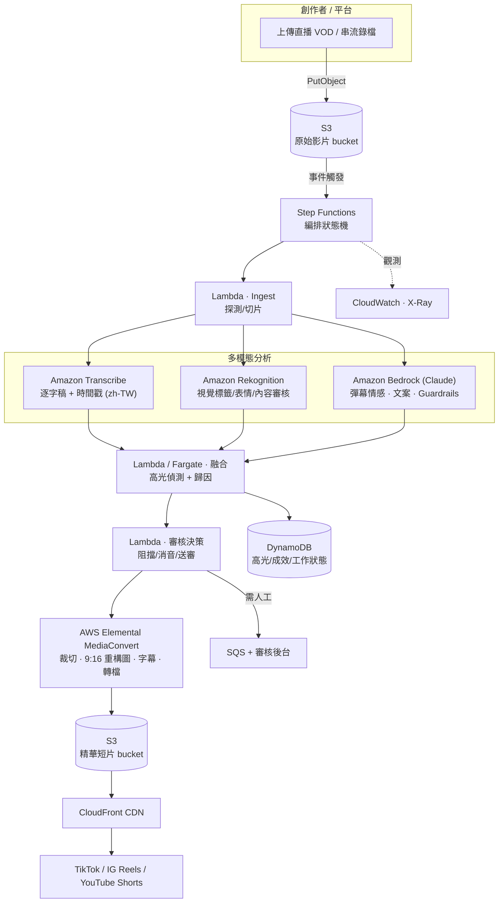

# AWS 部署架構設計

## 架構圖

## 服務角色對照
| AWS 服務 | 在 SparkReel 的角色 | 對應本地備援 |
|---|---|---|
| **S3** | 原始影片 / 產物 / 中繼儲存 | 本地檔案系統 |
| **Step Functions** | 端對端流程編排、重試、平行分支 | `pipeline.py` 直呼 |
| **Lambda** | 輕量階段（ingest、融合、審核決策、通知） | Python 函式 |
| **Fargate/ECS** | 較重的融合 / 批量工作（長於 15 分） | 本機執行緒池 |
| **Transcribe** | 語音轉逐字稿（含詞級時間戳，`speech_*` 訊號來源） | 字幕 sidecar / VAD |
| **Rekognition** | 視覺動態輔助、人臉表情、**內容審核標籤** | OpenCV / Haar |
| **Bedrock (Claude)** | 彈幕情感分析、標題/鉤子文案、**Guardrails 合規** | 詞典 / 樣板 |
| **MediaConvert** | 專業級裁切、重構圖、字幕燒錄、多碼率轉檔 | ffmpeg |
| **DynamoDB** | 高光、成效指標、工作狀態的低延遲存取 | `result.json` |
| **SQS** | 需人工複審內容的佇列 | 報告標記 |
| **CloudFront** | 短片全球低延遲分發 | 本地 HTTP 服務 |
| **CloudWatch / X-Ray** | 監控、追蹤、成本觀測 | 階段計時 |

> **對應程式碼**：`aws/clients.py` 為 boto3 client 工廠並偵測憑證；各 `signals/*`、`editing/`、
> `moderation/` 內的 `*_aws` 分支即為上述服務的呼叫點，缺憑證時自動 `try/except` 降級回本地。

## 可擴展性設計
1. **無伺服器優先**：S3 事件 → Step Functions → Lambda，隨上傳量自動水平擴展，閒置零成本。
2. **平行分支**：Transcribe / Rekognition / Bedrock 於狀態機中平行執行，縮短端對端延遲。
3. **重活外移 Fargate**：融合與批量轉檔放 Fargate，避開 Lambda 15 分鐘與資源上限。
4. **批量與佇列**：多頻道 / 整季 VOD 以 SQS 緩衝、依 worker 數彈性消化（對應 `batch.py`）。
5. **MediaConvert 佇列**：轉檔工作以佇列與保留/隨需混合排程，兼顧尖峰吞吐與成本。
6. **快取與重用**：逐字稿 / 訊號結果存 DynamoDB，重剪不同平台版型時免重算分析。
7. **成本控管**：Rekognition / Transcribe 以**稀疏取樣**（每 2 秒一幀、僅高光視窗）呼叫；
   Bedrock 以批次請求分析彈幕，降低 token 成本。
8. **多區域**：S3 + CloudFront 就近分發，Bedrock/Rekognition 選擇區域端點。

## 安全與合規
- IAM 最小權限、S3 加密（SSE-KMS）、VPC 端點；
- Bedrock **Guardrails** + Rekognition 內容審核構成上片前的合規閘；
- 個資（PII）偵測與遮蔽，敏感內容一律送人工複審佇列。
