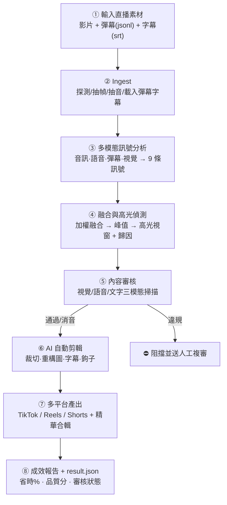
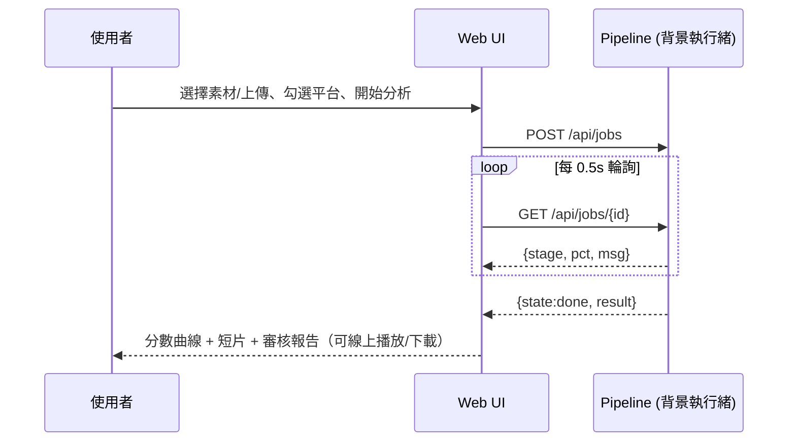

# 使用者流程（端對端）

## 總覽流程圖


## 時序（Web Live Demo）


## 三種操作路徑
### A. CLI（適合自動化 / 排程）
```bash
sparkreel analyze stream.mp4 --chat chat.jsonl --subtitles subs.srt --platforms tiktok,reels
```
即時進度條 → 彩色分析報告 → `assets/output/<job>/` 產物。

### B. 批量（適合整季 VOD / 多頻道）
```bash
sparkreel batch ./vods/ --workers 4
```
自動偵測每支影片的 sidecar 彈幕/字幕，並行處理，逐檔回報。

### C. Web（適合展示 / 非技術使用者）
`sparkreel serve` → 瀏覽器上：選素材 → 一鍵分析 → 即時進度 → 互動式結果（曲線 hover、平台切換、下載）。

## 輸入格式
- **影片**：mp4 / mov / mkv / flv / ts …（ffmpeg 可讀者皆可）
- **彈幕**：jsonl / json / csv，欄位彈性（`t/time/timestamp` + `user` + `text/message`），
  時間可為秒數或 `hh:mm:ss`
- **字幕**：srt / vtt（生產環境由 Amazon Transcribe 產生）
